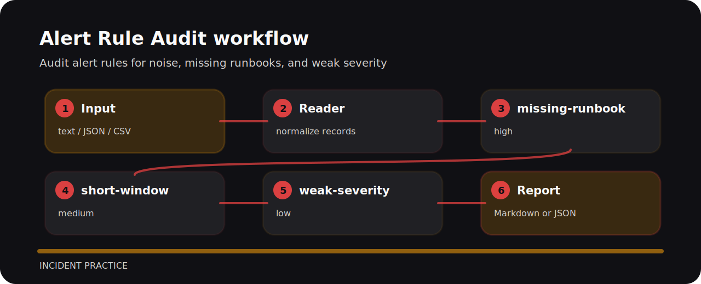

# Alert Rule Audit

| Detail | Value |
| --- | --- |
| Area | incident practice |
| Entry | `alert-rule-audit` |
| Input | plain text |
| Output | terminal findings, optional JSON |


## Review intent

Audit alert rules for noise, missing runbooks, and weak severity. The command is intentionally direct so it can sit in a local review, a CI step, or a one-off audit.

## Inspection line



## Decision points

- `missing-runbook` - paging alert has no runbook (high); Attach a runbook with diagnosis and rollback steps..
- `short-window` - alert window may be too short (medium); Use a longer window or burn-rate style condition..
- `weak-severity` - alert severity may be too weak for paging (low); Check that severity matches user impact..

## Local check

```bash
git clone https://github.com/mertefekurt/alert-rule-audit.git
cd alert-rule-audit
python -m pip install -e ".[dev]"
alert-rule-audit examples/sample.txt
```
