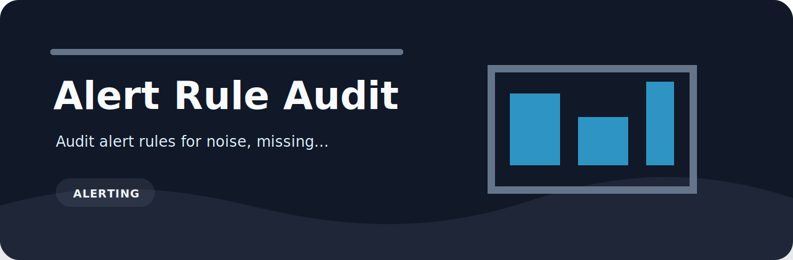

<p align="center">
  
</p>

# Alert Rule Audit

   

Audit alert rules for noise, missing runbooks, and weak severity.

## Why it exists

Small review tasks are easy to skip when the signal lives in notes, spreadsheets, or loosely formatted exports. `alert-rule-audit` turns those checks into a repeatable command with plain findings and CI-friendly exit codes.

## Quick run

```bash
python -m pip install -e ".[dev]"
alert-rule-audit examples/sample.txt
alert-rule-audit examples/sample.txt --json --fail-on medium
```

## Rule set

| Rule | Severity | What it catches |
| --- | --- | --- |
| `missing-runbook` | high | paging alert has no runbook |
| `short-window` | medium | alert window may be too short |
| `weak-severity` | low | alert severity may be too weak for paging |

## Input

The reader accepts plain text, JSON, JSONL, and CSV. That keeps it useful for hand-written notes, review exports, and small automation jobs.

## Sample risky input

```text
examples/sample.txt
```

## Development

```bash
python -m pip install -e ".[dev]"
ruff check .
pytest
python -m alert_rule_audit --help
```

`cli.py` handles arguments, `core.py` reads and evaluates records, and `rules.py` keeps the Alert Rule Audit policy easy to review.
