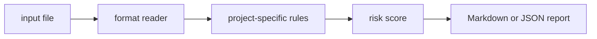

# alert-rule-audit

`alert-rule-audit` is a small local CLI that audit alert rules for noise, missing runbooks, and weak severity.

## Why it is useful

Noisy alerts damage on-call response. This CLI reviews alert rule exports for patterns that create fatigue or slow triage.

## Key features

- reads text, JSON, JSONL, or CSV inputs
- returns Markdown or JSON reports
- supports severity-based CI exit codes
- keeps all checks deterministic and offline
- includes focused rules for this project:
- `missing-runbook`: paging alert has no runbook
- `short-window`: alert window may be too short
- `weak-severity`: alert severity may be too weak for paging

## Installation

```bash
python -m pip install -e ".[dev]"
```

## Usage

```bash
alert-rule-audit examples/sample.txt
alert-rule-audit examples/sample.txt --json
alert-rule-audit path/to/input.txt --fail-on medium --out report.md
python -m alert_rule_audit --help
```

Example input:

```text
alert HighErrors severity warning for 1m runbook missing threshold any
```

## CLI options

```text
alert-rule-audit INPUT [--format auto|text|jsonl|csv|json] [--json]
             [--fail-on low|medium|high] [--out PATH]
```

`INPUT` is any alert rule YAML, JSON, or text export. The tool exits with code `2` when findings meet the selected
threshold, which makes it easy to use in GitHub Actions or release checks.

## Workflow



## Tests

```bash
ruff check .
pytest
python -m alert_rule_audit --help
```

## License

MIT
